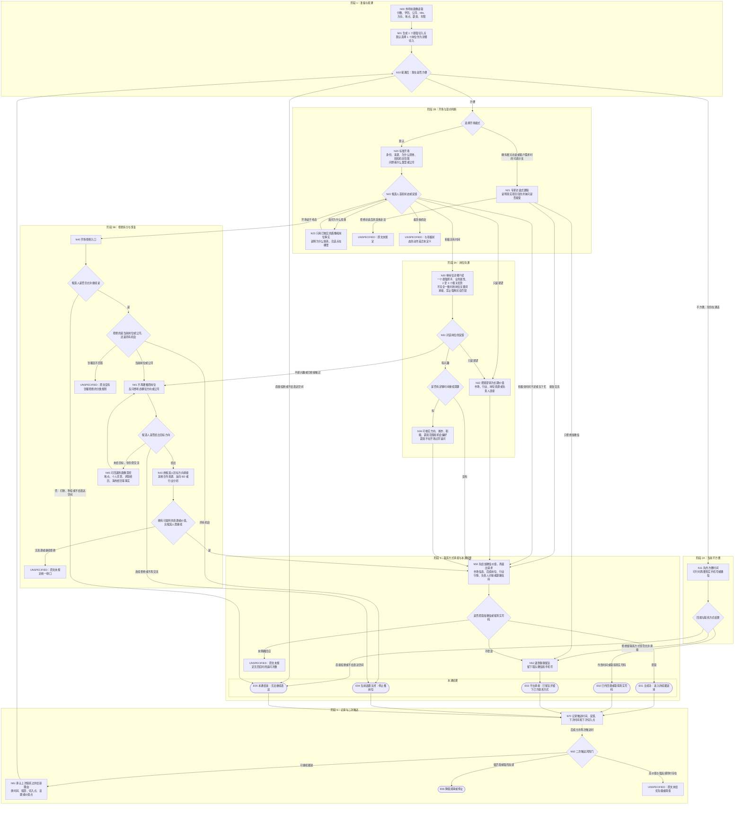

# Kiki 猎头通话策略节点结构图 v1

> 用途：把 Kiki 的结构化经验转换为“可跳转的条件状态机”，作为后续 EVAL LAB 评估规则的上游依据。  
> 本版只完成节点图与规则边界，不编写评分 Prompt。  
> 来源优先级：策略文档为主；完整交流记录只用于补足文档未画出的跳转。没有来源支持的内容统一标为 `UNSPECIFIED`，不使用常识补齐。

## 1. 先给结论：这不是一条固定话术，而是四层状态机

1. **画像层**：先读取候选人和岗位事实，形成一个最强切入点。
2. **首通层**：先判断能不能聊，再判断候选人是积极、观望还是拒绝。
3. **恢复层**：岗位被拒后，不继续硬推原岗位；先拆清拒绝范围，再转目标方向、其他资源或结束本话题。
4. **跨通话层**：首通未转化时，记录原因；二次触达必须换时间、措辞、切入点、话题或价值点，并受投诉风险约束。

主目标是取得微信或真实手机号、进入持续跟进池；方向、城市、职级、薪资范围和机会偏好是次级信息目标。候选人积极且有时间时可以一通深聊；候选人观望或忙时，优先把关系承接到微信/真实号码与下一次电话。

## 2. 完整节点跳转图

### 图中最重要的消歧

- **开场可说“简短机会范围”不等于详细介绍多个岗位。** 标准开场可以说明正在看若干相关机会；进入岗位介绍后，默认只详细讲一个岗位和一个最强抓手。多岗位资源是当前岗位被拒后的后手。
- **“不考虑”不能直接等于继续追问。** 先看候选人是否仍给表达空间；打断或挂断时，本通已经没有可执行动作。只有仍在通话时，才拆分“拒绝当前岗位/公司”还是“拒绝所有机会”。
- **“所有机会都不考虑”只代表当前话题/当前通话关闭。** 是否永久停止要另经过跨通话风险判断；原文没有冷却期和永久停呼阈值。
- **加微信成功是候选人结果，不是猎头单方动作。** 后续评估应评分“是否先给了原文支持的价值理由、是否在正确节点提出”，不能把候选人没加微信直接判成策略失败。

## 3. 节点规则表

### 3.1 外呼准备与首通主干

| 节点 | 可观察触发/前提 | 猎头侧必做动作 | 边界或禁止动作 | 下一节点/结果 | 来源 |
|---|---|---|---|---|---|
| `N00_PROFILE_PREP` | 准备联系候选人 | 读取分数、学历、公司、title、方向标签、地点、薪资、任职年限 | 纯通话文本无法观察该后台动作 | `N01` | 文档 p1、p4 |
| `N01_ONE_HOOK` | 已有画像与岗位信息 | 形成 1 个最强切入点；默认选 1 个岗位进入详细介绍 | 最强点的客观判定标准未给出 | `N10` | 文档 p3、p4 |
| `N10_AVAILABILITY` | 电话接通 | 确认现在是否方便；开场组件包括身份、来源、为什么联系、简短机会范围 | 原文对组件的精确先后有差异，宜评“是否出现”，不宜硬评固定顺序 | 方便→`N20/N21`；不方便→`N11` | 文档 p2、p4 |
| `N20_STANDARD_OPEN` | 候选人方便，默认岗位建联 | 让候选人回答“想看什么类型/哪些公司”，而不只是“看不看” | 不长篇解释；不开场过早追问薪资 | `N22` | 文档 p2、p4 |
| `N21_EXPERT_OPEN` | 高价值、未必积极看机会；且确有相关访谈/客户需求 | 说明项目目的与候选人关联，询问是否接受并提出建联 | 不得凭空捏造专家访谈或客户需求 | 接受→`N50` | 文档 p2；记录 10:10–11:43 |
| `N22_INTENT_STATE` | 标准开场之后 | 识别积极、观望、拒绝等状态 | “积极/观望/着急”的可观察阈值未定义 | 按图跳转 | 文档 p2；记录 03:02 |
| `N23_WHY_ME` | 候选人反问“为什么找我/合适在哪” | 用已核实的公司、方向、地点、负责人背景、团队偏好等事实回答 | 未核实的“团队喜欢某公司的人”不能使用 | 回到`N22/N30` | 记录 29:54–30:35 |
| `N30_SINGLE_ROLE` | 候选人愿意听岗位 | 从地点、业务方向、面试官背景、团队偏好、岗位产生原因中选最强抓手；说明业务属性；只讲 2–3 个最相关优势。可选信息包还包括团队规模、当前管理属性或未来管理潜力 | 不堆岗位；方向不完全一致时不强称完全匹配 | 感兴趣→`N33`；拒绝/已接触→`N41` | 文档 p3–p4；记录 27:43–32:13 |
| `N34_ACTIVE_DEEPEN` | 积极且有足够时间 | 可继续核实方向、城市、职级、薪资范围、机会偏好 | 原文没要求每通必须问完；记录仅把“城市→职级”作为建议顺序，不宜硬评；薪资挂接时机只明确为“后续”，未给异议处理 | `N50` | 文档 p1–p2；记录 02:09–04:31 |
| `N32_OBSERVING_VALUE` | 候选人只是观望 | 把“观望”转成长期价值：行业、客户、候选人资源、市场信息或负责人触达 | 实际没有资源时不得作事实承诺 | `N50` | 文档 p2 |
| `N50_VALUE_TO_CONTACT` | 已有岗位、市场、资源或长期价值可承接 | 先说至少一种具体价值，再提出加微信或留真实号码 | 不应只索要联系方式而不给理由 | 接受→`E01`；拒绝→`N52` | 文档 p2、p4 |

### 3.2 不方便、拒绝与恢复

| 节点 | 可观察触发/前提 | 猎头侧必做动作 | 边界或禁止动作 | 下一节点/结果 | 来源 |
|---|---|---|---|---|---|
| `N11_BUSY_CALLBACK` | 明确说“现在不方便”，但未挂断 | 先询问/确认方便回拨时间；虚拟号场景下可请求真实号码 | 不在此时展开岗位；“要手机号还是微信”存在来源差异 | `E02/N52/E05` | 文档 p3；记录 12:21–14:04 |
| `N40_REJECTION_ENTRY` | 开场就说“不考虑” | 先判断候选人是否仍允许表达 | 打断、秒挂时，后续追问均为 `N/A` | 可继续→拆分拒绝范围；不可继续→`E05` | 文档 p3；记录 21:14–22:16 |
| `N41_ROLE_REJECTION` | 只拒绝当前岗位/公司，或听完岗位后不感兴趣/已接触 | 停止推原岗位；反问想看哪些方向/公司 | 不应立即再推第二个具体岗位；不继续硬推原岗位 | 给偏好→`N43`；继续拒绝→`E04` | 文档 p3、p5；记录 21:14–22:16、28:19 |
| `N43_REVERSE_MATCH` | 候选人给出目标方向 | 用目标方向承接其他合作资源、反向 BD 或行业分析 | 这些属于能力承诺，需有真实资源支持 | 有真实价值且愿继续→`N50` | 文档 p3 |
| `N45_PROFILE_DEEP_DIVE` | 表层岗位话题已耗尽，但候选人仍愿意交流 | 从地点、个人背景、求职经历、海外经历等已知事实寻找新兴趣点 | 家人、伴侣、户口等只能作假设性问题示例，不能当成事实 | 回到`N41/N43/N50` | 记录 25:32–26:42 |
| `N52_PLATFORM_FALLBACK` | 不愿加微信，或不便分支中拒绝留真实联系方式 | 退到脉脉留言，留下己方微信和手机号 | 平台动作若不在评估输入中只能记 `N/A` | `E03` | 文档 p4；记录 14:04 |

### 3.3 跨通话状态

| 节点 | 可观察触发/前提 | 猎头侧必做动作 | 边界或禁止动作 | 下一节点/结果 | 来源 |
|---|---|---|---|---|---|
| `N70_TOUCH_LOG` | 每次触达后 | 记录打过的时间、候选人反馈、下次推荐时间、下次切入点 | 纯通话文本无法观察 CRM 记录 | `N60` | 文档 p4 |
| `N60_RECONTACT_GATE` | 首通忙、拒微、未转化或当前话题关闭，准备再次触达 | 先结合上次原因与风险决定是否继续 | “高价值、低匹配、强烈反感、持续活跃”均无量化阈值 | 继续→`N61`；降频/停止→`E06` | 文档 p4–p5 |
| `N61_SECOND_TOUCH` | 决定再次触达 | 承认上次联系过并给新理由；换时间、措辞、切入点、话题或价值点 | 8–10 点通勤、中午、晚饭点、19 点后、周末只是可尝试时段，不是硬规则；不原样重复上一套话；访谈必须有真实依据 | 重新进入`N10` | 文档 p4–p5 |

## 4. 结束状态

| 状态 | 含义 | 触发条件 | 是否等于永久结束 |
|---|---|---|---|
| `E01_CONTACT_POOL` | 已获微信或真实手机号，进入持续跟进池 | 候选人接受加微或留真实号码 | 否，是主成功状态 |
| `E02_CALLBACK_SET` | 已约回拨，可能同时取得真实号码 | 候选人现在不方便但给出回拨承接 | 否，等待下一通 |
| `E03_PLATFORM_HANDOFF` | 微信/号码未取得，已退到脉脉并留下己方联系方式 | 候选人拒绝加微或拒绝留号码 | 否，是否再触达未给固定期限 |
| `E04_TOPIC_CLOSED_CURRENT_CALL` | 当前岗位/机会话题停止推进 | 明确所有机会都不考虑，或持续拒绝且仍无转机 | 否；永久停呼阈值未定义 |
| `E05_CALL_ENDED_NO_SPACE` | 本通没有继续表达空间 | 秒挂、直接挂断、强打断 | 否；后续是否再拨需另做风险判断 |
| `E06_REDUCE_OR_STOP` | 降频或停止触达 | 低匹配或强烈反感 | 可能是；但原文没有客观阈值 |
| `E_UNSPECIFIED` | 原文无法决定后续 | 例如薪资不匹配、拒绝披露薪资、目标方向无资源、访谈被拒后的转轨 | 不得自行补写 |

补充：候选人积极且有时间时，“本通深聊完成”可以作为信息完成标签，但它可与 `E01` 同时存在，不宜设计成互斥终点。

## 5. 后续做 EVAL LAB 时，哪些规则可以硬判

本节不是评分 Prompt，只是防止下一步把节点图用错。

可以硬判的核心只有四类：

1. **分支识别是否正确**：如只拒当前岗位，不能当成拒绝所有机会；秒挂后不能假设还能继续追问。
2. **明确必做语义动作是否出现**：如岗位拒绝后询问目标方向；加微信前给具体价值理由。
3. **明确禁止动作是否发生**：如连续硬推同一岗位、方向不一致却强称完全匹配、虚构专家访谈。
4. **下一节点是否有来源支持**：如微信拒绝后退到平台，而不是继续反复索要微信。

不能直接硬判：

- 候选人最终是否加微信、是否给手机号；这是结果，不是猎头单方行为质量。
- “最强抓手”“最相关优势”是否全局最优，除非 EVAL 同时看到完整画像与全部岗位信息。
- 后台画像读取、CRM 记录、平台留言，除非 EVAL 有相应系统日志。
- 专家访谈、反向 BD、业务负责人对接是否真实，除非 EVAL 有外部事实清单。
- 固定联系时段、重拨次数、冷却期和停呼上限；原文没有可采用的数值规则。

## 6. 明确的原文空缺：必须保留为 `UNSPECIFIED`

1. “着急看机会”与“积极看机会”的不同动作。
2. 积极、观望、持续活跃、高价值、低匹配、强烈反感、连续拒绝的量化或可观察阈值。
3. 未接通、空号、语音信箱、本人否认身份等未接通类分支。
4. 回拨时间与联系方式都不给时，“虚拟号再拨”与“立即平台留言”的优先级。
5. 每次重拨间隔、最多重拨次数、冷却期、永久停呼条件。
6. 薪资异议、预算不符、拒绝披露薪资、现金/总包分歧的处理和终止条件。
7. 已经接触过岗位后的细分状态：已投递、面试中、已拒绝、重复推荐等。
8. 岗位与画像部分不匹配时的最低相关度阈值和终止线。
9. 目标方向已知但猎头没有对应资源时的统一收口。
10. 专家访谈被拒后，是回标准岗位开场还是结束。
11. 候选人反问薪资、汇报线、团队稳定性、信息来源、隐私、虚拟号码等问题的分支。
12. 加微成功后的第一条消息、真实手机号转微信的时机与方式。
13. 标准礼貌结束语和明确的“勿扰”登记机制。

## 7. 交流记录中不应沉淀成通用规则的内容

- “两周打 50 多次电话”是个人成功轶事，不是安全频控标准；策略文档反而明确要求控制投诉风险。
- “70%/80% 的人只是忙或不方便”是经验性比例，不能用于给单个候选人自动归因。
- “不方便”不能自动推断为不抗拒；“不看”也不能自动推断为忙或已有 offer。
- 用私人候选人关系、候选人前任领导创业等资源挽回连续拒绝，Kiki 明确说明高度个人化，不能成为通用必做节点。
- 家人、伴侣、户口、回江浙沪、海外经历等只能作为基于画像的假设性问题库，不能当成候选人事实，也不能要求每通都问。
- 未核实的“团队喜欢某公司背景”“有专家访谈”“可以对接业务负责人”等不能作为事实表达。

## 8. 来源索引

### 策略文档页码

- p1：总策略；外呼前画像读取；薪资后置。
- p2：电话目标；积极/观望分流；标准开场；观望价值；加微信理由；真实专家访谈分支。
- p3：单岗优先、岗位抓手、方向不完全一致的边界；不方便、开场拒绝、岗位拒绝、反向资源。
- p4：拒微后平台承接；持续拒绝与二次换话题；二次触达时间建议、触达记录、投诉风险；提示词动作清单前半。
- p5：拒绝处理与二次触达动作清单；练习方式不属于运行时节点。

### 交流记录补充位置

- 03:02：积极/观望与通话时长分流；对应记录行 31–32。
- 08:46–14:04：拒微、真实访谈真实性、不方便、回拨与平台留言；对应记录行 73–110。
- 21:14–22:16：硬打断与仍可追问的区别；拒绝范围与“当前话题结束”；对应记录行 157–164。
- 25:32–26:42：表层话题耗尽后的画像深挖；对应记录行 175–185。
- 27:43–32:13：单岗位优先、岗位信息包、已接触过岗位、方向部分不一致时的承接；对应记录行 190–230。

## 9. 建议的后续节点字段

后续转换为 EVAL LAB 规则时，每个节点至少保留以下字段：

`node_id`、`phase_scope`、`trigger_signal`、`guard`、`required_actions`、`optional_actions`、`forbidden_or_boundary`、`state_updates`、`transition_map`、`terminal_status`、`eval_level`、`source_locator`、`unknown_fallback`。

其中 `unknown_fallback` 必须默认进入 `UNSPECIFIED / N/A`，不能让评估 Agent 自己补猎头常识。
