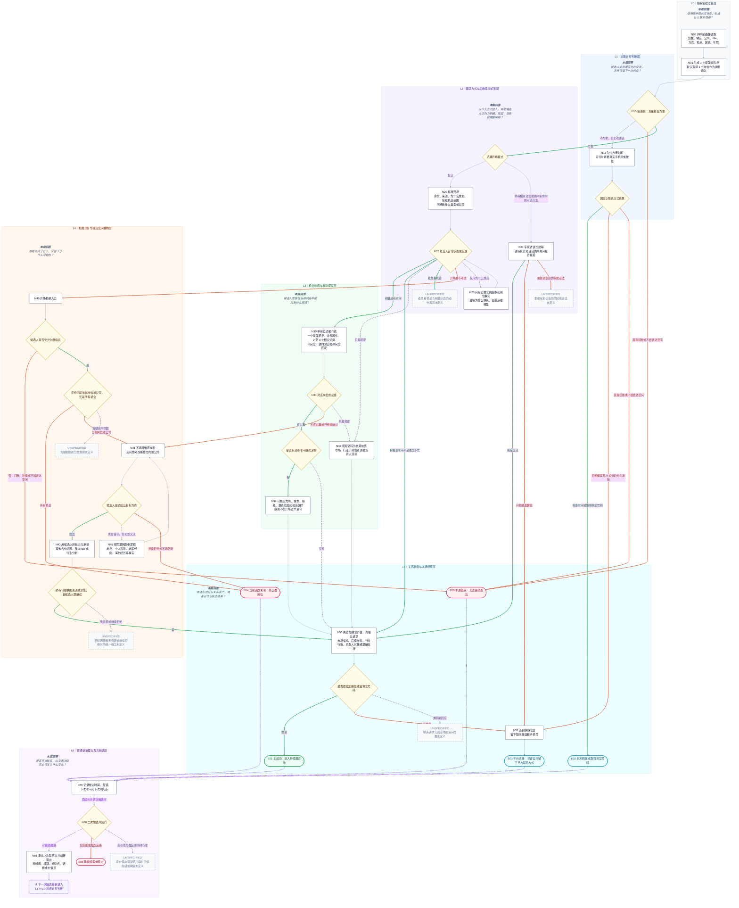

# Kiki 猎头通话策略节点结构图 v2｜纵向决策泳道版

> 本版仅优化读图方式，不改变 v1 的节点、分支条件和 59 条业务跳转。  
> 纵向背景表示“决策阶段”；节点形状表示“动作、判断、结果或规则空缺”；连接线颜色表示“候选人反馈性质”。

## 1. 读图规则

- **七条纵向阶段泳道**：按照候选人状态从“联系依据”逐步推进到“跨通话治理”，而不是按照提问、介绍、挽留等操作类型划层。
- **绿色实线**：正反馈或开放信号，允许关系继续推进。
- **橙红实线**：负反馈、拒绝或停止信号。
- **蓝灰虚线**：中立、情境性、模糊或尚未定性的反馈。
- **细灰实线**：结构跳转，不代表候选人态度。
- **紫色点线**：跨通话记录、风险判断和再次触达回环。
- **灰色虚线节点**：原始资料没有规定后续，必须保留为 `UNSPECIFIED`。

## 2. 纵向阶段泳道图

## 3. 七层节点归属核对

| 决策层 | 节点数量 | 节点 |
|---|---:|---|
| L0 联系依据准备 | 2 | `N00`、`N01` |
| L1 对话许可判断 | 3 | `N10`、`N11`、`B11` |
| L2 建联方式与初始意向识别 | 7 | `G20`、`N20`、`N21`、`N22`、`N23`、`U01`、`U08` |
| L3 机会响应与推进深度 | 5 | `N30`、`N31`、`N32`、`N33`、`N34` |
| L4 拒绝诊断与机会空间重构 | 10 | `N40`、`C40`、`R40`、`N41`、`R41`、`N43`、`G43`、`N45`、`U02`、`U10` |
| L5 关系承接与本通结果 | 9 | `N50`、`W50`、`N52`、`U03`、`E01`、`E02`、`E03`、`E04`、`E05` |
| L6 跨通话治理与再次触达 | 5 | `N70`、`N60`、`N61`、`E06`、`U04` |
| **总计** | **41** | 与 v1 一致 |

## 4. 分层解释

- `L3` 不是单纯的“深入推进”：它同时容纳具体岗位深聊与观望价值承接，表示候选人愿意投入到什么程度。
- `L4` 不叫“挽留层”：这里的目标不是继续说服候选人接受原岗位，而是诊断拒绝范围并重新定义剩余机会空间。
- 所有 `E01–E05` 统一放进本通结果层。这样从早期阶段直接跳到结果的路径会更清楚，例如“不方便但约到时间”直接落到 `E02`。
- `UNSPECIFIED` 节点保留在产生它的阶段内，而不是集中到一个未知区，便于定位具体是哪一层存在规则缺口。
- `N61 → N10` 是跨通话回环，表示一次新的接通与许可判断，不是本通内部的普通返回。
- 为避免 Mermaid 自动布局被跨通话回边拉歪，图中将该边显示为 `N61 → BACK10（回到 L1/N10）`；`BACK10` 只是视觉引用，不是新增业务节点。

## 5. 数据完整性声明

- 业务节点总数：41；另有 7 个阶段说明节点和 1 个跨层视觉引用节点，均不参与业务状态计数。
- 业务跳转总数：59。
- 未增加新的业务规则、结束条件、重拨次数或薪资异议分支。
- 节点规则、原文空缺、来源索引与评估边界继续以 `kiki通话策略节点结构图_v1.md` 为准。
